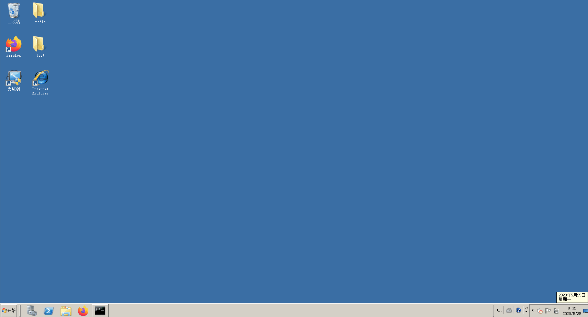

# RedisWriteFile

此脚本是通过 `Redis` 主从写出无损文件，可用于 `Windows` 平台下写出无损的 `EXE`、`DLL`、 `LNK` 和 `Linux` 下的 `OS` 等二进制文件

也可以用无杂质覆写 `Linux` 中的 `/etc/shadow`

用法：
> 最好在 powershell 环境中使用

```plaintext
______         _ _     _    _      _ _      ______ _ _
| ___ \       | (_)   | |  | |    (_) |     |  ___(_) |
| |_/ /___  __| |_ ___| |  | |_ __ _| |_ ___| |_   _| | ___
|    // _ \/ _` | / __| |/\| | '__| | __/ _ \  _| | | |/ _ \
| |\ \  __/ (_| | \__ \  /\  / |  | | ||  __/ |   | | |  __/
\_| \_\___|\__,_|_|___/\/  \/|_|  |_|\__\___\_|   |_|_|\___|

                    Author : R3start
          Reference : redis-rogue-server.py

Usage: rediswritefile.py [options]

Options:
  -h, --help            show this help message and exit
  --rhost=REMOTE_HOST   target host
  --rport=REMOTE_PORT   target redis port, default 6379
  --lhost=LOCAL_HOST    rogue server ip
  --lport=LOCAL_PORT    rogue server listen port, default 21000
  --rpath=Target_File_Path
                        write to target file path, default '.'
  --rfile=Target_File_Name
                        write to target file name, default dump.rdb
  --lfile=Local_File_Name
                        Local file that needs to be written
  --auth=AUTH           redis password
  -v, --verbose         Show full data stream

```

## Ref

- `exp.so`: <https://github.com/n0b0dyCN/redis-rogue-server>
- `exp.dll`: <https://github.com/0671/RedisModules-ExecuteCommand-for-Windows>

## Example

如覆写宝塔配置文件：


覆写 `sethc.exe`:


覆写 `LNK` :


